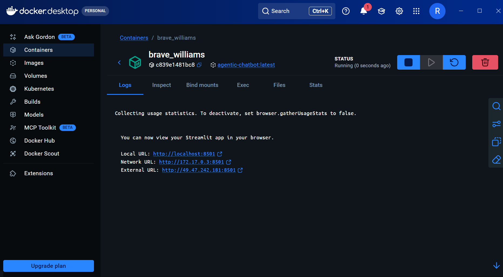
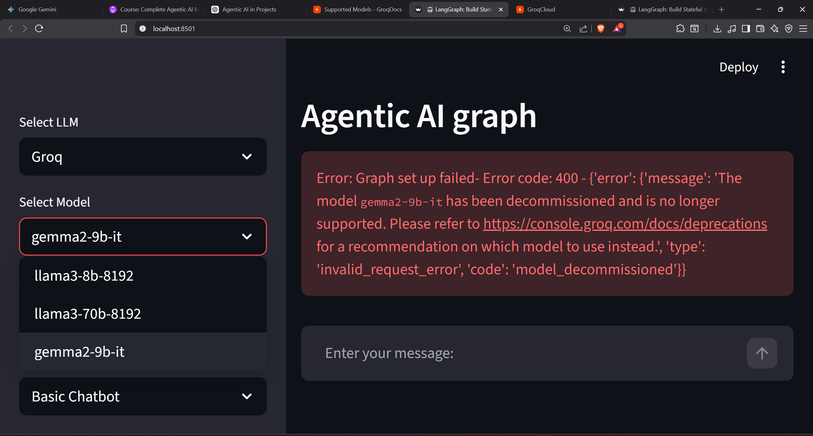

<details>
---
title: Agentic AI Web Chatbot
emoji: 🤖
colorFrom: blue
colorTo: indigo
sdk: streamlit
python_version: "3.10"
app_file: app.py
pinned: false
---
</details>

# working Hugging_face link 
https://huggingface.co/spaces/Richard9905/agentic_ai_web_chatbot

### workflows proof
[](https://github.com/Richard-Selvaraj-99/agentic_chatbot/actions/workflows/deploy.yml)


[](https://github.com/Richard-Selvaraj-99/agentic_chatbot/actions/workflows/deploy.yml)


[](https://github.com/Richard-Selvaraj-99/Agentic_AI_with_github_CI-CD_and_Huggingface_deployment/actions/workflows/deploy.yml)


#STEP BY STEP PROCESS OF HOW TO RE-CREATE THIS PROJECT


##REQUIREMENTS


## 🛠️ Requirements

---

### 📦 1. Libraries
All required libraries are listed in `requirements.txt`

---

### 🐍 2. Create Environment
```bash
conda create -p ./venv python==3.13 -y
pip install -r requirements.txt
conda activate ./venv
```

---

### 🗂️ 3. Create GitHub Repo via CLI
```bash
gh repo create
```
- Enter your repo name
- Select `public` or `private`
- Add a `.gitignore` for Python (include any files/folders to exclude)

---

### 🔗 4. Clone the Repo
```bash
git clone https://github.com/Richard-Selvaraj-99/Agentic_AI_with_github_CI-CD_and_Huggingface_deployment.git
```

---

### 🧪 5. Run Tests Locally
```bash
pytest
```
> Verifies that all environment variables are configured correctly before pushing

---

### 🤗 6. Configure HuggingFace Deployment
- Create your HuggingFace Space
- Update `deploy.yml` with your HF Space link

---

### 🔐 7. Add Repository Secrets
Go to **Repo → Settings → Secrets and Variables → Actions** and add:

| Secret | Description |
|---|---|
| `HF_TOKEN` | HuggingFace access token |
| `DOCKER_USERNAME` | Docker Hub username |
| `DOCKER_PASSWORD` | Docker Hub password |

> This triggers the CI/CD pipeline — deploys to HuggingFace and pushes your Docker image to Docker Hub for future reproduction or migration

---

### 🚀 8. After Workflow Succeeds
Go to your HuggingFace Space and select:

| Option | Use Case |
|---|---|
| **Basic Chatbot** | Non-agentic workflow |
| **Chatbot with Web Search** | Agentic workflow |

#screenshots
 


# warning!
this error is to showcase that you need update the model name in accordance to the groq's provided LLM models  at https://console.groq.com/docs/models change the model accordingly at 

src/langraphagenticai/ui/uiconfiggile.ini


